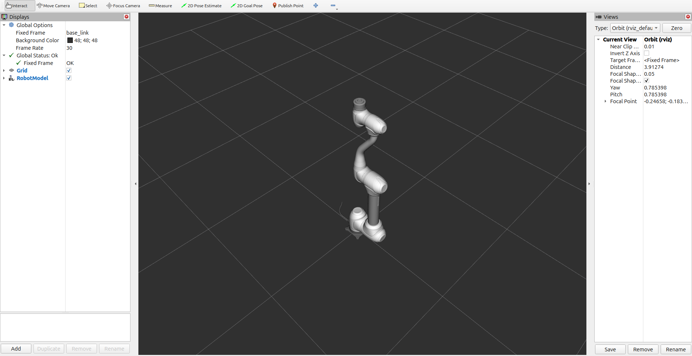

.. _basic_tutorials:

basic_tutorials
===============

RViz2 Launch
------------

This launch file starts Rviz2 for visualizing the robot model and its state.

**Command:**

.. code-block:: bash

   ros2 launch dsr_bringup2 dsr_bringup2_rviz.launch.py [arguments]

**Arguments:**

- ``name``: Robot namespace (Default: ``dsr01``)
- ``host``: IP address of the Doosan Controller (Default: ``127.0.0.1``)
- ``port``: Communication port (Default: ``12345``)
- ``mode``: Launch mode (``real`` or ``virtual``)
- ``model``: Robot model name (e.g., ``m1013``)
- ``color``: Robot color (``white`` or ``blue``)
- ``rt_host``: Real-time controller IP (Default: ``192.168.137.50``)

**Examples:**

- Real Robot:

  .. code-block:: bash

     ros2 launch dsr_bringup2 dsr_bringup2_rviz.launch.py mode:=real host:=192.168.137.100 model:=m1013

- Virtual Robot:

  .. code-block:: bash

     ros2 launch dsr_bringup2 dsr_bringup2_rviz.launch.py mode:=virtual host:=127.0.0.1 model:=m1013

.. raw:: html

     
     

Gazebo Simulation
-----------------

This launch file starts the robot in the Gazebo Harmonic simulator with optional RViz2.

**Command:**

.. code-block:: bash

   ros2 launch dsr_bringup2 dsr_bringup2_gazebo.launch.py [arguments]

**Arguments:**

- ``name``: Robot namespace (Default: ``dsr01``)
- ``host``: IP address of the Doosan Controller (Default: ``127.0.0.1``)
- ``port``: Communication port (Default: ``12345``)
- ``mode``: Launch mode (``real`` or ``virtual``)
- ``model``: Robot model name (e.g., ``m1013``)
- ``color``: Robot color (``white`` or ``blue``)
- ``gui``: Launch RViz2 (``true`` or ``false``)
- ``gz``: Enable Gazebo simulation (``true`` or ``false``)
- ``x``, ``y``, ``z``, ``R``, ``P``, ``Y``: Robot pose in simulation
- ``rt_host``: Real-time controller IP (Default: ``192.168.137.50``)
- ``use_sim_time``: Use simulation time (Default: ``true``)

**Examples:**

- Real Mode:

  .. code-block:: bash

     ros2 launch dsr_bringup2 dsr_bringup2_gazebo.launch.py mode:=real host:=192.168.137.100 model:=m1013

- Virtual Mode:

  .. code-block:: bash

     ros2 launch dsr_bringup2 dsr_bringup2_gazebo.launch.py mode:=virtual host:=127.0.0.1 port:=12346 name:=dsr01 x:=0 y:=0

- Multi-arm (Virtual):

  .. code-block:: bash

     ros2 launch dsr_bringup2 dsr_bringup2_spawn_on_gazebo.launch.py mode:=virtual host:=127.0.0.1 port:=12347 name:=dsr02 x:=2 y:=2

.. note::

   For multi-arm setup, each robot must use a unique ``name``, ``port``, and ``x/y`` position to avoid collision in Gazebo.

MuJoCo Simulation
-----------------

This launch file starts the robot in MuJoCo simulator with an optional scene XML.

**Command:**

.. code-block:: bash

   ros2 launch dsr_bringup2 dsr_bringup2_mujoco.launch.py [arguments]

**Arguments:**

- ``name``: Robot namespace (Default: ``dsr01``)
- ``host``: IP address of the Doosan Controller (Default: ``127.0.0.1``)
- ``port``: Communication port (Default: ``12345``)
- ``mode``: Launch mode (``real`` or ``virtual``)
- ``model``: Robot model name (e.g., ``m1013``)
- ``color``: Robot color (``white`` or ``blue``)
- ``gui``: Launch RViz2 (Default: ``true``)
- ``mj``: Enable MuJoCo simulation (Default: ``true``)
- ``rt_host``: Real-time controller IP (Default: ``192.168.137.50``)
- ``use_sim_time``: Use simulation time (Default: ``true``)
- ``gripper``: Gripper support (Default: ``none``)
- ``scene_path``: Relative path to MuJoCo scene file (e.g., ``demo/slope_demo_scene.xml``)

**Example:**

.. code-block:: bash

   ros2 launch dsr_bringup2 dsr_bringup2_mujoco.launch.py mode:=virtual model:=m1013

MoveIt2 Integration
-------------------

⚠ **Note:** MoveIt2 requires Doosan Controller version **2.12 or higher**.

Use this launch file to perform motion planning and manipulation tasks with MoveIt2.

**Command:**

.. code-block:: bash

   ros2 launch dsr_bringup2 dsr_bringup2_moveit.launch.py [arguments]

**Arguments:**

- ``mode``: Launch mode (``real`` or ``virtual``)
- ``model``: Robot model (e.g., ``m1013``)
- ``host``: IP address of the Doosan Controller

**Examples:**

- Real Mode:

  .. code-block:: bash

     ros2 launch dsr_bringup2 dsr_bringup2_moveit.launch.py mode:=real model:=m1013 host:=192.168.137.100

- Virtual Mode:

  .. code-block:: bash

     ros2 launch dsr_bringup2 dsr_bringup2_moveit.launch.py mode:=virtual model:=m1013 host:=127.0.0.1
