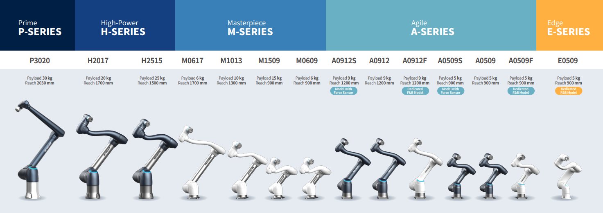

.. _tutorials:

Tutorials
=========
This section provides step-by-step examples for launching the Doosan robot in various environments such as RViz2, Gazebo, and MoveIt2.  
The tutorials are designed to support all models in the Doosan Robot Series, including A, M, H, E and P types.

.. raw:: html

     

.. toctree::
   :maxdepth: 2
   :caption: Contents:

   tutorials/basic_tutorials
   tutorials/advanced_tutorials
