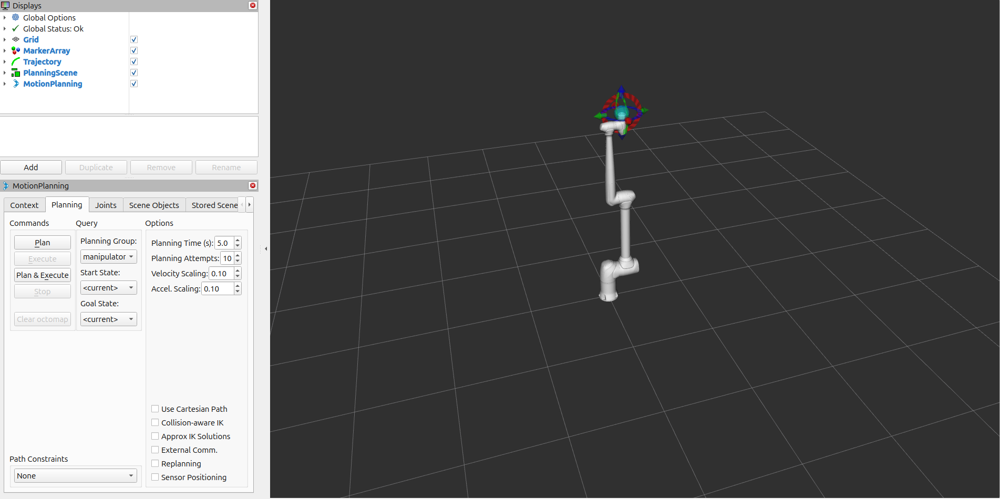
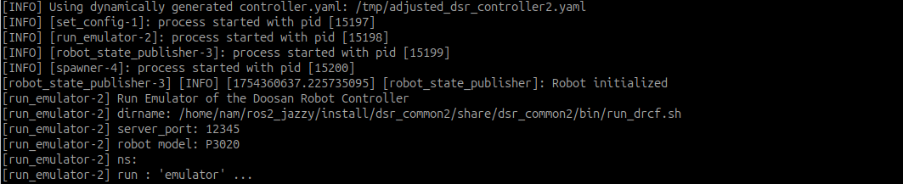
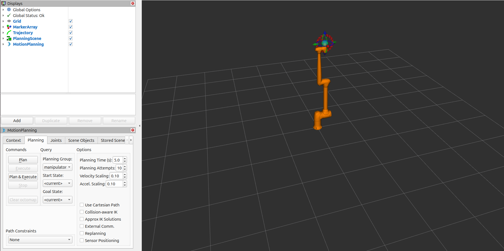
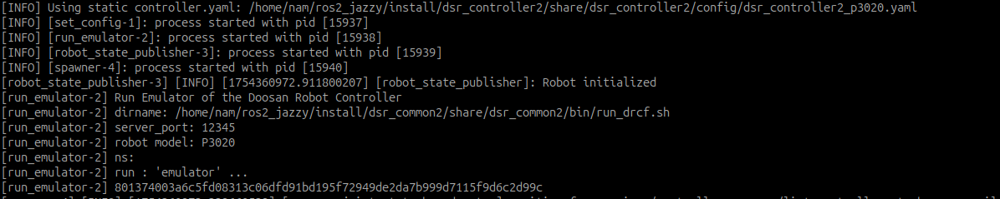

.. _moveit_advanced_tutorial:

MoveIt 2 Dynamic yaml launch option
====================================

This tutorial introduces advanced usage of the MoveIt 2 integration launch file with dynamic and static YAML selection for controller configuration.

.. note::

   This launch setup is compatible with **Doosan Controller version 2.12 or higher**.

.. raw:: html

     

Overview
--------

The advanced MoveIt 2 launch system provides flexibility to select between:

- **Dynamic YAML Generation**: Automatically generates `controller.yaml` at runtime based on the robot model’s active and passive joints.

- **Static YAML Usage**: Loads predefined YAML files such as `dsr_controller2.yaml` or `dsr_controller2_<model>.yaml` from the `dsr_controller2` package.

This mechanism is especially useful when:

- Simulating or controlling robots with custom or non-standard DOF (Degrees of Freedom).
- Deploying to different robot variants without manually managing multiple static configuration files.

For instance, the **P3020** model is a 5-DOF robot, which typically requires a dedicated static configuration file. With **dynamic YAML**, 
you can skip this manual step. The system will automatically adjust the controller configuration using the URDF definition.

.. raw:: html

     

Command
-------

.. code-block:: bash

   ros2 launch dsr_bringup2 dsr_bringup2_moveit.launch.py [arguments]

.. raw:: html

     

Arguments
---------

- ``mode``: Operation mode (``real`` or ``virtual``)
- ``model``: Robot model name (e.g., ``m1013``, ``a0509``, ``p3020``)
- ``host``: IP address of the robot controller
- ``dynamic_yaml``: Set to ``true`` to auto-generate `controller.yaml`, or ``false`` to use static YAML files

.. raw:: html

     

Examples
--------

Dynamic Controller YAML Generation
^^^^^^^^^^^^^^^^^^^^^^^^^^^^^^^^^^

.. code-block:: bash

   ros2 launch dsr_bringup2 dsr_bringup2_moveit.launch.py mode:=virtual model:=p3020 host:=127.0.0.0 dynamic_yaml:=true

This will:

- Parse the robot’s URDF to extract active and passive joints
- Dynamically create a temporary YAML config with only the robot’s actuated joints
- Apply this configuration to the controller manager without requiring manual file edits

.. raw:: html

     

Static Controller YAML (Model-Specific)
^^^^^^^^^^^^^^^^^^^^^^^^^^^^^^^^^^^^^^^

.. code-block:: bash

   ros2 launch dsr_bringup2 dsr_bringup2_moveit.launch.py mode:=virtual model:=p3020 dynamic_yaml:=false

This will:

- Search for a file named `dsr_controller2_p3020.yaml` in the `dsr_controller2/config/` folder
- If not found, fallback to the default `dsr_controller2.yaml` file

.. raw:: html

     

How It Works
------------

1. The launch file reads `model`, `color`, and `dynamic_yaml` arguments.
2. The robot’s URDF (converted from xacro) is parsed to identify active and passive joints.
3. Based on the `dynamic_yaml` flag:
   - If `true`, a temporary `controller.yaml` is auto-generated with correct joint names.
   - If `false`, the system tries to load an existing YAML file for the specific model.
4. The final configuration is passed to `ros2_control_node`.

.. .. image:: /_static/tutorial/moveit_advanced_flow.png
..    :alt: MoveIt2 Advanced Launch Flow
..    :width: 100%
..    :align: center

.. raw:: html

     

URDF / Xacro Requirements for Dynamic YAML
^^^^^^^^^^^^^^^^^^^^^^^^^^^^^^^^^^^^^^^^^^

To ensure the dynamic generator functions correctly, your robot model’s URDF (typically converted from `.xacro`) must:

- Clearly define **which joints are actuated vs passive**
  (e.g., using `<joint type="fixed">` or naming convention).
- Include all joint names in a consistent order.
- Use valid joint types (`revolute`, `prismatic`, etc.) that are compatible with `ros2_control`.

Example snippet in `.xacro`:

.. code-block:: xml

   <joint name="joint_4" type="fixed">
     <origin xyz="0 -0.89 -0.1731" rpy="1.5708 0 0"/>
     <parent link="link_3"/>
     <child link="link_4"/>
   </joint>

This setup allows you to focus on the robot design while letting the system automatically adjust
its control configuration for MoveIt2 planning and execution.

For more detailed setup instructions, including recommended changes to URDF, Xacro macros,
ros2_control plugin definitions, and associated YAML files
(e.g., `initial_positions.yaml`, `ros2_controllers.yaml`, `joint_limits.yaml`),
please refer to the complete guide:

.. toctree::
   :maxdepth: 1
   
   p3020_detailed_guide
