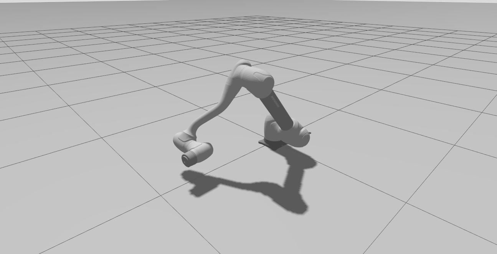
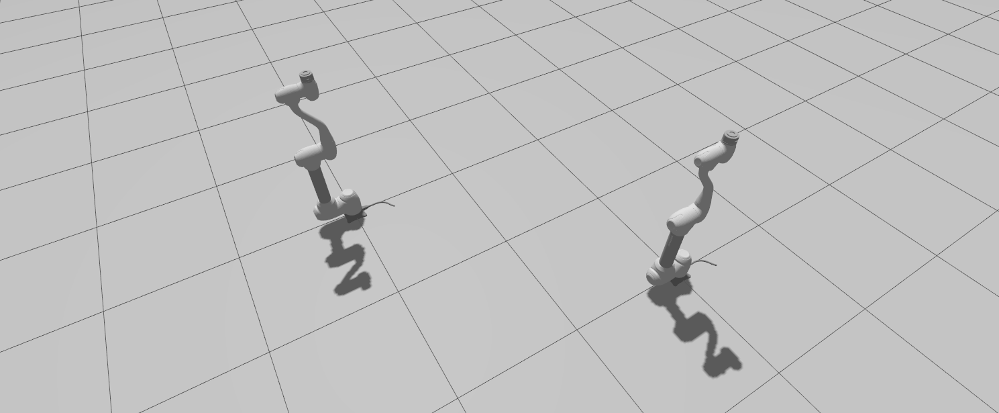

.. _gazebo_tutorial:

Gazebo Simulation
=================

This launch file starts the robot in the Gazebo simulator with optional RViz2.

**Command:**

.. code-block:: bash

   ros2 launch dsr_bringup2 dsr_bringup2_gazebo.launch.py [arguments]

**Arguments:**

- ``name``: Robot namespace (Default: ``dsr01``)
- ``host``: IP address of the Doosan Controller (Default: ``127.0.0.1``)
- ``port``: Communication port (Default: ``12345``)
- ``mode``: Launch mode (``real`` or ``virtual``)
- ``model``: Robot model name (e.g., ``m1013``)
- ``color``: Robot color (``white`` or ``blue``)
- ``gui``: Launch RViz2 (``true`` or ``false``)
- ``gz``: Enable Gazebo simulation (``true`` or ``false``)
- ``x``, ``y``, ``z``, ``R``, ``P``, ``Y``: Robot pose in simulation
- ``rt_host``: Real-time controller IP (Default: ``192.168.137.50``)
- ``use_sim_time``: Use simulation time (Default: ``true``)

Examples
----------

Launch
~~~~~~~~

- Real Mode:

  This will connect to the real robot enabling motion control for both the real and simulated robots.

  .. code-block:: bash

     ros2 launch dsr_bringup2 dsr_bringup2_gazebo.launch.py mode:=real host:=192.168.137.100 model:=m1013

- Virtual Mode:

  .. code-block:: bash

     ros2 launch dsr_bringup2 dsr_bringup2_gazebo.launch.py mode:=virtual host:=127.0.0.1 port:=12346 model:=m1013

  .. image:: ../../_static/tutorial/gazebo_launch.png
     :alt: Robot Model Preview
     :width: 800px
     :align: center

Example move
~~~~~~~~

Once Gazebo is running, you can test the setup by executing a simple motion script.

Open a new terminal and run the following command:

.. code-block:: bash

    ros2 run dsr_example dance

.. raw:: html

    
    

Multi-arm (Virtual):
----------

You can spawn several virtual robots in Gazebo for multi-arm setups. 

For multi-arm setup, each robot must use a unique ``name``, ``port``, and ``x/y`` position to avoid collision in Gazebo.

.. note::

   Since each robot has its own DRCF emulator, system load may be heavy with multiple robots. Which could lead to performance degradation.

- Launch the first robot with ``dsr_bringup2_gazebo``:
.. code-block:: bash

   ros2 launch dsr_bringup2 dsr_bringup2_gazebo.launch.py mode:=virtual host:=127.0.0.1 port:=12345 name:=dsr01 model:=m1013 x:=0 y:=0 color:=white

- Launch the second robot with a different configurations with ``dsr_bringup2_spawn_on_gazebo``:
.. code-block:: bash

   ros2 launch dsr_bringup2 dsr_bringup2_spawn_on_gazebo.launch.py mode:=virtual host:=127.0.0.1 port:=12347 name:=dsr02 x:=2 y:=2

.. raw:: html
   
    
    

