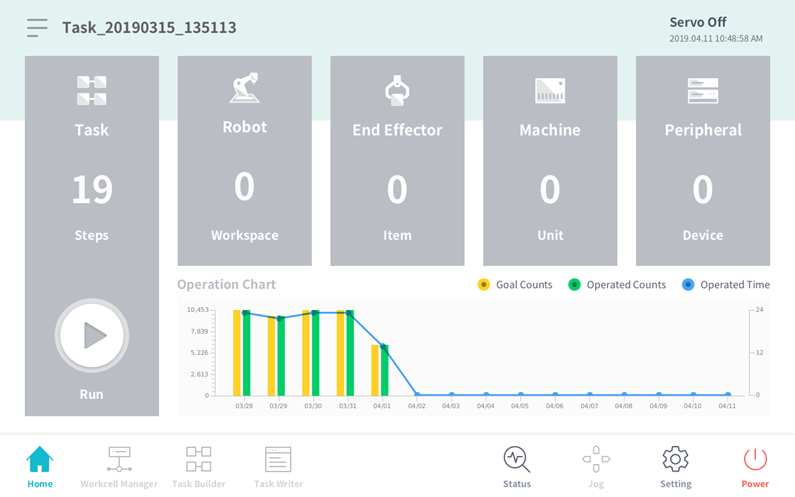
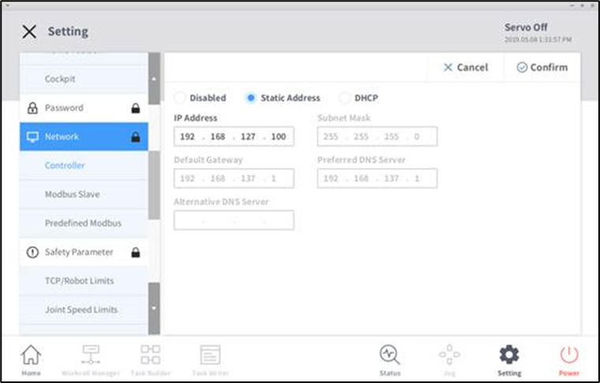

.. _operation_modes:

Operation Modes
===============

This section describes the operation modes available for the Doosan robot system.

**Virtual Mode**
----------------

Use virtual mode when operating without a physical robot. (**Docker is required**)

If you omit the ``mode`` argument, it defaults to ``virtual``.

.. code-block:: bash

   ros2 launch dsr_bringup2 dsr_bringup2_gazebo.launch.py mode:=virtual

When launched in virtual mode, the **emulator** containing a virtual robot and controller (**DRCF**: Doosan Robot Controller Framework) will automatically start and stop during the launch lifecycle.

.. note::
   - Emulator location: ``dsr_common2/bin/``
   - One emulator instance will be launched for each robot.
   - The system automatically assigns different ports for multiple robots.

To check if the emulator is running correctly, you can use the following command after launch:

.. code-block:: bash

   docker ps   # If emulator runs in Docker container

The output should look something like this:

.. code-block::
   
   CONTAINER ID   IMAGE                            COMMAND                  CREATED          STATUS          PORTS                                                                 NAMES
   28c08ed25f1b   doosanrobot/dsr_emulator:3.0.1   "/bin/bash /start_se…"   21 seconds ago   Up 20 seconds   1122/tcp, 3601/tcp, 0.0.0.0:12345->12345/tcp, [::]:12345->12345/tcp   dsr01_emulator

**Real Mode**
-------------

Use real mode when controlling an actual robot.

In real mode, the system communicates with the physical robot controller over TCP/IP.

- Default IP: ``192.168.137.100`` |br| 
- Default Port: ``12345``

Pass the following arguments to launch in real mode:

.. code-block:: bash

   ros2 launch dsr_bringup2 dsr_bringup2_gazebo.launch.py mode:=real host:=192.168.137.100 port:=12345

.. note::
  Make sure your PC is connected to the **same subnet** as the robot controller. |br|
  (e.g., PC IP: ``192.168.137.X``)

**Connect with the Real Robot Controller**

- Turn on the robot and check the **Teach Pendant** screen.

.. raw:: html

     

- Navigate to ``Settings → Network`` and confirm the controller IP.

.. raw:: html

     

- Use this IP address as the ``host`` argument in your launch command. |br|

- If ROS 2 control node is running successfully, the control will transfer from the TP to ROS 2.

- A pop-up will appear on the TP confirming the transfer is complete.

.. image:: images/etc/transfer_control_pop_up.png
   :alt: Control Transfer Pop-up
   :width: 800px
   :align: center

.. raw:: html

    
    

