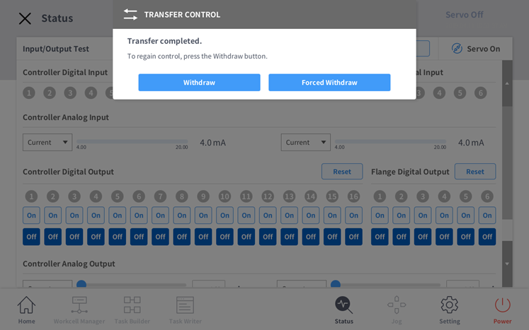

.. _operation_modes:

Operation Modes
===============
This section describes the operation modes available for the Doosan robot system.

**Virtual Mode**
----------------

If you are driving without a real robot, use virtual mode. (Need Docker)

Selecting virtual mode sets the mode argument to virtual when running the dsr_bringup2 launch file. If you omit the argument, it defaults to virtual.

.. code-block:: bash

  ros2 launch dsr_bringup2 dsr_bringup2_gazebo.launch.py mode:=virtual

When ROS2 launches in virtual mode, the **emulator(DRCF)** runs automatically.

.. note::
  DRCF location: ``dsr_common2/bin/``

One emulator is required for each robot.

When controlling multiple robots, the emulator will automatically run as many as the number of robots and use different ports.

**Real Mode**
----------------

Use real mode to drive a real robot.

In real mode operation, communication must be established with the real robot controller.

The default IP of the robot controller is ``192.168.137.100`` and the port is ``12345``.

  Selecting arguments(``mode:=real host:=192.168.137.100 port:=12345``) to real mode when running the dsr_bringup2 launch file.

.. code-block:: bash

    ros2 launch dsr_bringup2 dsr_bringup2_gazebo.launch.py mode:=real host:=192.168.137.100 port:=12345

Connect with real robot controller
~~~~~~~~

Turn on the robot and look at TP(Teach Pandaunt) screen.

.. image:: ../_static/tutorial/teach_pandaunt_screen.png
     :alt: Robot Model Preview
     :width: 800px
     :align: center

The user can set static IP in Setting -> Network of TP screen.

.. image:: ../_static/tutorial/network_of_tp_screen.png
     :alt: Robot Model Preview
     :width: 800px
     :align: center

Check the IP of the controller set in the Network tab, and set this IP in the command.
(host := ROBOT_IP)

If the ROS2 control node is correctly executed, the control is now transfer from TP to ROS2.

If successful, a pop-up message will appear on the TP screen.
